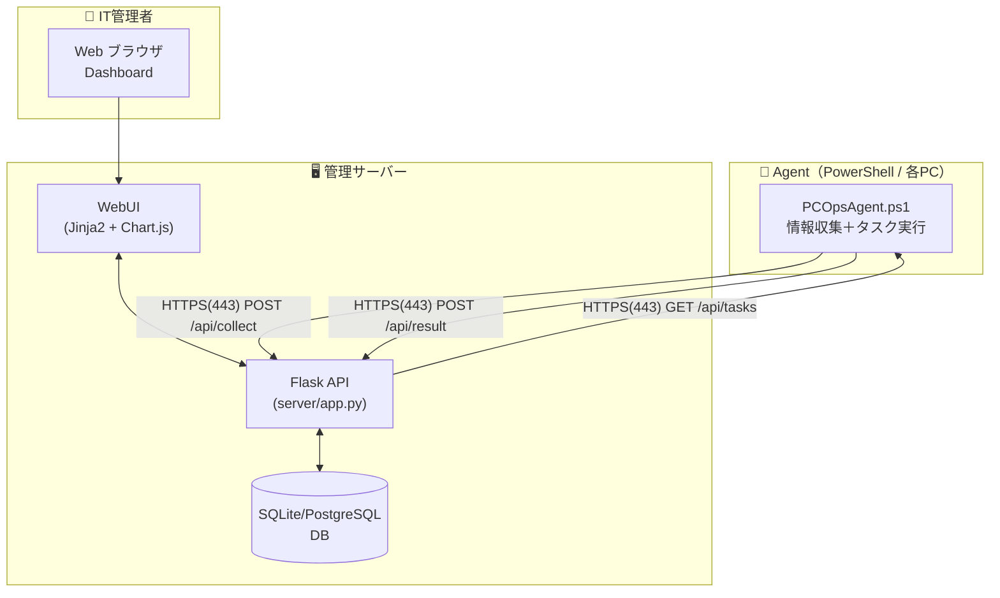
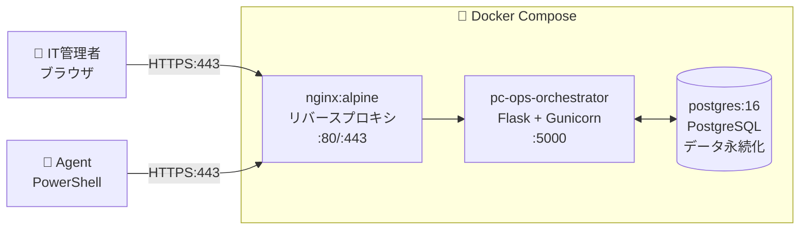
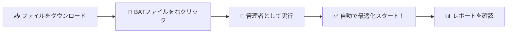
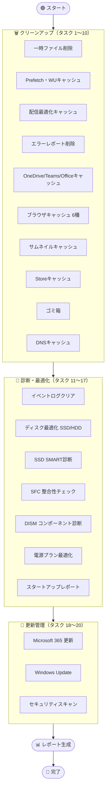
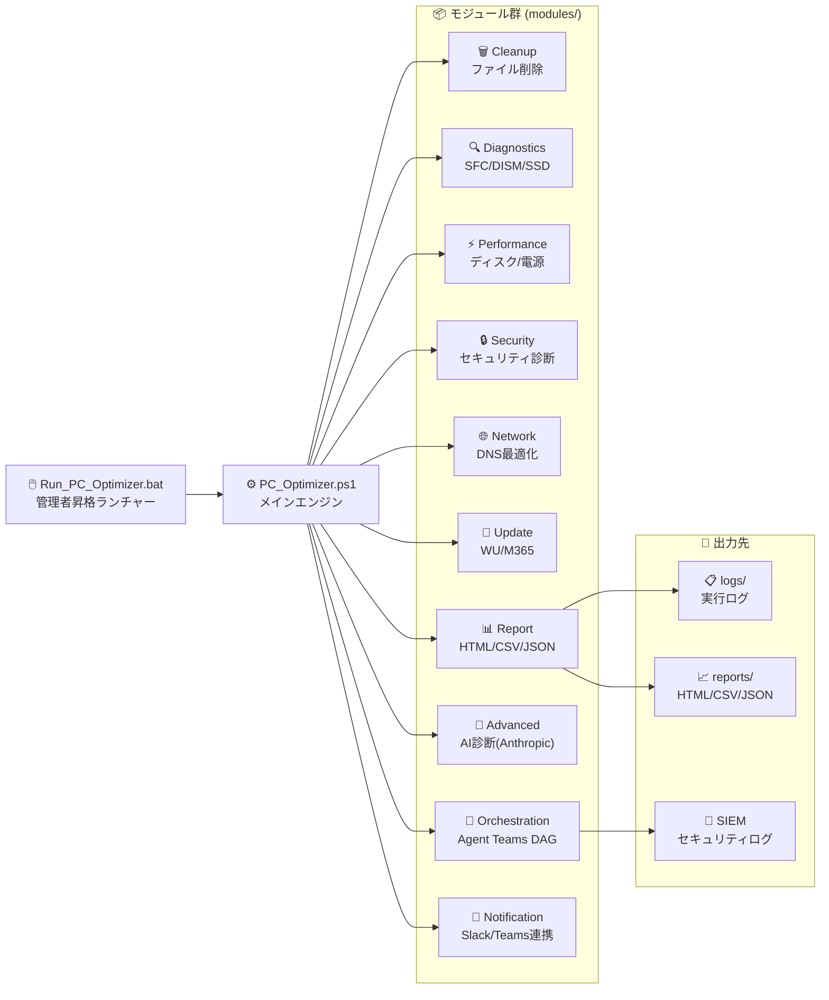
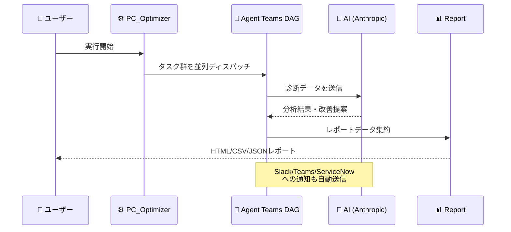

# 🖥️ PC-Ops Orchestrator — PC運用オーケストレーター

> **HTTPS のみを使用した安全な情報収集と、WebUIによる一元管理・遠隔操作を実現するPC運用基盤**

[](https://github.com/PowerShell/PowerShell)
[](https://www.python.org)
[](https://flask.palletsprojects.com)
[](https://www.microsoft.com/windows)
[](LICENSE)

---

## 🏗️ システムアーキテクチャ



| コンポーネント | 役割 | 技術 |
|---|---|---|
| 📡 Agent | PC情報収集・タスク実行（センサーのみ） | PowerShell 5.1+ |
| 🖥️ API Server | データ受信・タスク管理・認証・アラート生成 | Flask + SQLAlchemy |
| 🗄️ Database | PC情報・タスク・ログ・アラート保存 | SQLite / PostgreSQL |
| 🖥️ WebUI | ダッシュボード・PC一覧・タスク管理・アラート管理 | HTML + JS + Chart.js |
| 🐳 Docker | コンテナ運用（nginx + Flask + PostgreSQL） | Docker Compose |

---

## 🎯 既存機能：PC Optimizer（スタンドアロン最適化ツール）

PC が重い・遅い・容量が足りない、そんな悩みを **ワンクリックで解決** する従来の最適化エンジンです。

| 🗑️ クリーンアップ | 🔧 診断・修復 | 🔄 更新管理 | 📊 レポート生成 |
|---|---|---|---|
| 一時ファイル削除 | SFC システム修復 | Windows Update | HTML グラフ |
| ブラウザキャッシュ | DISM 診断 | Microsoft 365 更新 | CSV/JSON 出力 |
| ゴミ箱の空化 | SSD SMART 診断 | セキュリティ更新 | スコア履歴 |
| DNS キャッシュクリア | ディスク最適化 | ドライバー確認 | AI 分析レポート |

---

---

## 🚀 Server セットアップ（管理サーバー）

### 前提条件
- Python 3.10+
- PowerShell 5.1+（Agent用）

### 手順

```bash
# 依存関係インストール
pip install -r server/requirements.txt

# 初期セットアップ（管理者ユーザー作成）
python server/seed.py

# サーバー起動（開発用）
python server/app.py
# -> http://localhost:5000
```

### 運用モード

```bash
# 本番起動（Linux）
gunicorn -w 4 -b 0.0.0.0:443 wsgi:app

# 本番起動（Windows - waitress）
pip install waitress
waitress-serve --port=443 wsgi:app
```

---

## 🐳 Docker デプロイ（推奨）



```bash
# 1. 環境変数ファイルを作成（.env）
cat <<'EOF' > .env
SECRET_KEY=your-secret-key
JWT_SECRET_KEY=your-jwt-secret
POSTGRES_USER=pcops
POSTGRES_PASSWORD=your-db-password
POSTGRES_DB=pcops
EOF

# 2. 起動
docker compose up -d

# 3. 初期管理者作成
docker compose exec server python seed.py

# 4. 状態確認
docker compose ps
```

| サービス | コンテナ名 | 役割 |
|---|---|---|
| server | pc-ops-server | Flask アプリ（Gunicorn） |
| db | pc-ops-db | PostgreSQL 16 |
| nginx | pc-ops-nginx | TLS終端・リバースプロキシ |

---

## 📡 Agent デプロイ手順（対象PC）

```powershell
# 1. agent/config.json を編集（サーバーURL、APIキー）
# 2. タスクスケジューラーに登録（5分間隔自動実行）
powershell -ExecutionPolicy Bypass -File agent/Register-AgentTask.ps1

# 手動実行
powershell -ExecutionPolicy Bypass -File agent/PCOpsAgent.ps1
```

---

## 🖥️ WebUI 機能一覧

| 画面 | 機能 |
|---|---|
| 📊 Dashboard | 全PC状態サマリー、健全性分布グラフ、OS内訳、アクティブアラート、操作ログ |
| 🖥️ PC一覧 | 検索・フィルタリング、状態表示、スコア確認、**CSVエクスポート**（30秒自動更新） |
| 🔍 PC詳細 | 基本情報・ハードウェア情報・リソース履歴グラフ・タスク実行・**Windows Update一覧**・**インストール済みソフトウェア一覧** |
| 📋 タスク管理 | タスク作成（クリーンアップ/更新/診断/カスタム）、状態監視、**CSVエクスポート**（30秒自動更新） |
| ⚠️ アラート管理 | アラート確認・解決・同期、重大度フィルタ、**CSVエクスポート**（30秒自動更新） |
| 📝 操作ログ | WebUIおよびAgent操作の監査ログ、ユーザー/操作種別フィルタ |

---

## 🔌 API エンドポイント一覧

| Method | Endpoint | Auth | 説明 |
|---|---|---|---|
| POST | `/api/auth/login` | - | WebUIログイン（JWT取得） |
| POST | `/api/auth/setup` | - | 初期管理者作成 |
| POST | `/api/collect` | API Key | Agent → 情報送信 |
| POST | `/api/collect/detail` | API Key | Agent → 詳細情報送信 |
| GET | `/api/tasks/pending` | API Key | Agent → 未処理タスク取得 |
| POST | `/api/result` | API Key | Agent → 実行結果送信 |
| GET | `/api/tasks` | JWT | WebUI → タスク一覧 |
| POST | `/api/tasks` | JWT | WebUI → タスク作成 |
| GET | `/api/pcs` | JWT | WebUI → PC一覧 |
| GET | `/api/pcs/<id>` | JWT | WebUI → PC詳細 |
| GET | `/api/dashboard/stats` | JWT | WebUI → 統計情報 |
| GET | `/api/dashboard/recent` | JWT | WebUI → 操作ログ |
| GET | `/api/dashboard/health-distribution` | JWT | WebUI → 健全性分布 |
| GET | `/api/dashboard/os-breakdown` | JWT | WebUI → OS別集計 |
| GET | `/api/alerts` | JWT | WebUI → アラート一覧（フィルタ・ページング） |
| GET | `/api/alerts/export.csv` | JWT | アラート一覧 CSV エクスポート |
| POST | `/api/alerts/sync` | JWT | アラート同期（新規生成＋自動解決） |
| POST | `/api/alerts/<id>/acknowledge` | JWT | アラート確認済みマーク |
| POST | `/api/alerts/<id>/resolve` | JWT | アラート解決済みマーク |
| GET | `/api/pcs/export.csv` | JWT | PC一覧 CSV エクスポート |
| GET | `/api/pcs/<id>/software` | JWT | PC詳細 → インストール済みソフトウェア一覧 |
| GET | `/api/pcs/<id>/updates` | JWT | PC詳細 → Windows Update 一覧 |
| GET | `/api/tasks/export.csv` | JWT | タスク一覧 CSV エクスポート |
| GET | `/api/logs` | JWT | 操作ログ（監査ログ）一覧 |

---

## 🔐 認証方式

| 対象 | 方式 | デフォルト値 |
|---|---|---|
| Agent → API | Bearer Token（API Key） | `default-agent-key` |
| WebUI → API | JWT（ログイン後取得） | admin / admin |
| 管理者 | JWT（admin role） | seed.py で作成 |

### CORS 設定

`CORS_ORIGINS` 環境変数でフロントエンドのオリジンを許可（デフォルト: `http://localhost`）。

```bash
export CORS_ORIGINS="https://admin.example.com,https://staging.example.com"
```

### タスク作成バリデーション

`POST /api/tasks` の `task_type` は以下の値のみ受け付けます。

| 値 | 内容 |
|---|---|
| `cleanup` | 一時ファイル削除 |
| `update` | Windows Update / ドライバー更新 |
| `diagnose` | SFC / DISM 診断 |
| `collect` | 情報再収集 |
| `custom` | カスタムコマンド（`command` フィールド必須、512文字以内） |

---

## 🚀 スタンドアロン：PC Optimizer 使い方（3ステップ）



### 手順詳細

1. **📥 ダウンロード** — `PC_Optimizer.ps1` と `Run_PC_Optimizer.bat` を同じフォルダへ
2. **🖱️ 右クリック** — `Run_PC_Optimizer.bat` を右クリック
3. **👑 管理者実行** — 「管理者として実行」を選択 → UAC で「はい」

完了後、レポートが `reports/` フォルダに自動保存されます。

### GUI で使う場合

PowerShell GUI から実行したい場合は `GUI/Run_PC_Optimizer_GUI.bat` を起動してください。  
GUI 仕様書は `docs/GUI/` にまとまっています。

---

## 🔄 実行される 20 タスク



---

## 🏗️ システム構成図



---

## 🤖 Agent Teams — AI オーケストレーション

v4.0 から **AI エージェントチーム** が自律的に診断・修復・レポートを行います。



---

## 📊 対応環境

| 項目 | 要件 |
|:---:|---|
| 💻 OS | Windows 10 / 11 |
| ⚡ PowerShell | 5.1 以上（7.x 推奨） |
| 👑 権限 | 管理者権限必須 |
| 🌐 ネットワーク | 任意（オフライン動作対応） |
| 🤖 AI 機能 | Anthropic API キー（オプション） |

---

## 📁 ファイル構成

```
📁 PC-Ops-Orchestrator/
├── 🖱️ Run_PC_Optimizer.bat       ← スタンドアロン実行
├── ⚙️ PC_Optimizer.ps1            最適化エンジン（2,353行）
│
├── 🖥️ server/                    ← 管理サーバー（Flask）
│   ├── app.py                    アプリケーションファクトリ
│   ├── config.py                 設定
│   ├── models.py                 SQLAlchemyモデル（7テーブル）
│   ├── auth.py                   JWT + API Key認証
│   ├── routes/                   Blueprintルート（auth/collect/tasks/pcs/dashboard/alerts）
│   ├── templates/                Jinja2テンプレート（dashboard/pc_list/tasks/alerts）
│   ├── static/                   CSS + JS（alerts.js など）
│   ├── requirements.txt          Python依存関係
│   └── test_api.py               統合テスト（18項目）
│
├── 📡 agent/                     ← Agent（PowerShell）
│   ├── PCOpsAgent.ps1            情報収集＋タスク実行
│   ├── config.json               設定
│   └── Register-AgentTask.ps1    タスクスケジューラー登録
│
├── 📦 modules/                   PowerShellモジュール（既存）
├── ⚙️ config/                    設定ファイル（既存）
├── 🪟 GUI/                       PowerShell GUI（既存）
├── 📊 reports/                   レポート出力（既存）
├── 📋 logs/                      実行ログ（既存）
└── 🧪 tests/                     テストスクリプト（既存）
```

---

## 🧪 品質・テスト状況

| テストスイート | 件数 | 状態 |
|---|:---:|:---:|
| API 統合テスト（Python） | 18項目 | ✅ PASS |
| 機能テスト（Test_PCOptimizer.ps1） | 93件 | ✅ PASS |
| Pester テスト（PCOptimizer.Pester） | 50件 | ✅ PASS |
| Agent Teams E2E テスト | 複数 | ✅ PASS |
| Agent Teams 負荷テスト | 複数 | ✅ PASS |
| スモークテスト（PS5.1 / PS7） | 複数 | ✅ PASS |

---

## 📚 ドキュメント一覧

| ドキュメント | 内容 |
|---|---|
| 📖 [詳細 README](docs/README.md) | 全機能の詳細説明 |
| 🚀 [インストール手順](docs/インストール手順.md) | セットアップ方法 |
| 📋 [使い方](docs/使い方.md) | 詳細な操作方法 |
| 🏗️ [アーキテクチャ](docs/アーキテクチャ.md) | システム設計図 |
| 🔧 [トラブルシューティング](docs/トラブルシューティング.md) | 困ったときは |
| 🔒 [セキュリティ](docs/セキュリティ.md) | セキュリティ考慮事項 |
| 📝 [変更履歴](docs/変更履歴.md) | バージョン履歴 |
| ⚙️ [config 仕様](docs/config仕様.md) | 設定ファイル仕様 |
| 📊 [ログ仕様](docs/ログ仕様.md) | ログファイル仕様 |
| 🤖 [エージェント開発ガイド](docs/エージェント開発ガイド.md) | AI エージェント開発 |
| 🗃️ [リポジトリ運用方針](docs/リポジトリ運用方針.md) | Git/CI 運用ルール |

---

## 🔔 外部連携（オプション）

以下の外部サービスと連携できます（デフォルト無効）。

| サービス | 用途 | 設定 |
|---|---|---|
| 🤖 Anthropic API | AI 診断・改善提案 | `config/config.json` |
| 💬 Slack | 実行結果通知 | `config/config.json` |
| 📧 Microsoft Teams | 実行結果通知 | `config/config.json` |
| 🎫 ServiceNow | インシデント自動起票 | `config/config.json` |
| 📌 Jira | チケット自動生成 | `config/config.json` |
| 🔐 SIEM | セキュリティログ連携 | `config/config.json` |

---

## ⚠️ 注意事項

- 必ず **管理者権限** で実行してください
- 実行中は PC の操作を最小限にしてください
- 初回実行前に重要なデータのバックアップを推奨します
- `modules/Notification.psm1` の外部通知はデフォルト無効です

---

## 📜 ライセンス

MIT License — 個人・法人を問わず無料でご利用いただけます。

---

<div align="center">

**🖥️ PC-Ops Orchestrator** — *PC運用を、もっとスマートに。*

[🐛 バグ報告](https://github.com/Kensan196948G/PC-Ops-Orchestrator/issues) | [💡 機能要望](https://github.com/Kensan196948G/PC-Ops-Orchestrator/issues) | [📖 Server API](server/) | [📡 Agent](agent/)

</div>
