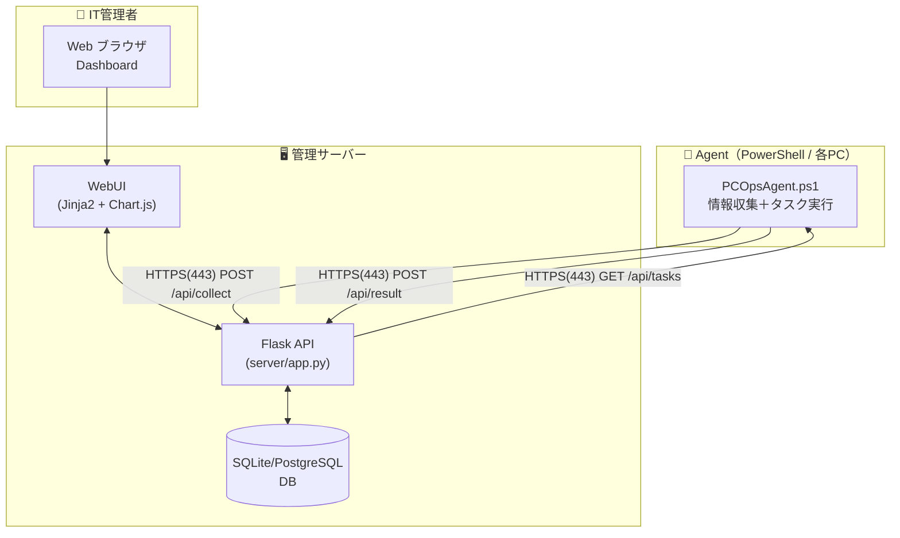
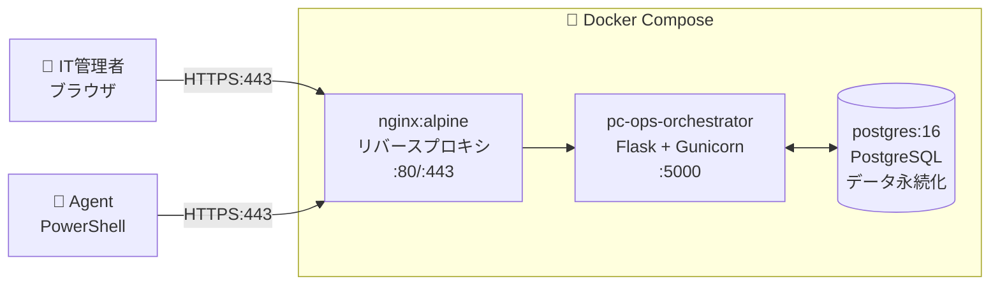
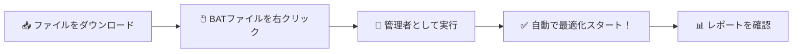
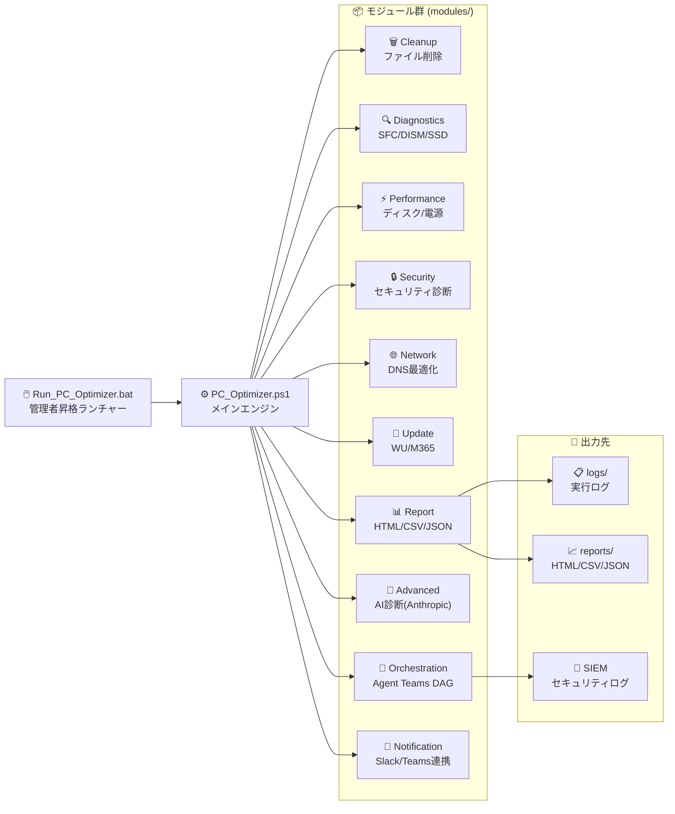
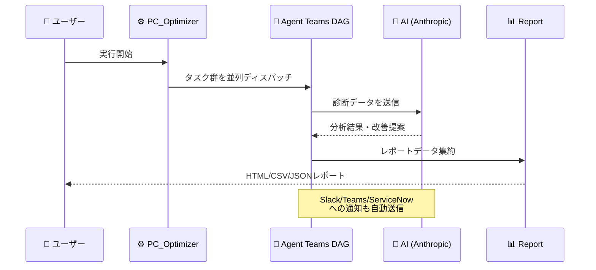
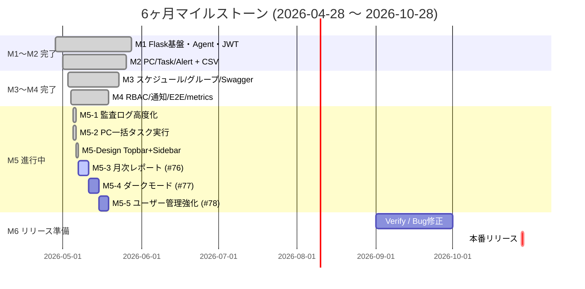
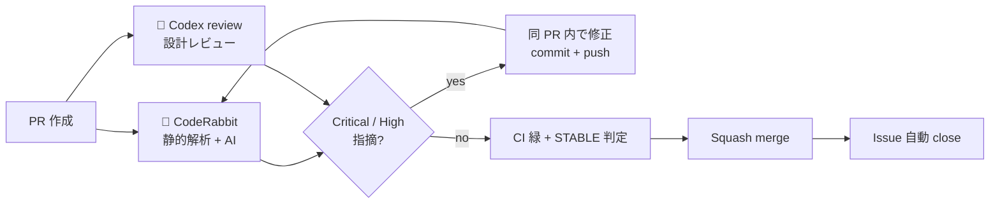

# 🖥️ PC-Ops Orchestrator — PC運用オーケストレーター

> **HTTPS のみを使用した安全な情報収集と、WebUIによる一元管理・遠隔操作を実現するPC運用基盤**

[](https://github.com/PowerShell/PowerShell)
[](https://www.python.org)
[](https://flask.palletsprojects.com)
[](https://www.microsoft.com/windows)
[](LICENSE)

---

## 🏗️ システムアーキテクチャ



| コンポーネント | 役割 | 技術 |
|---|---|---|
| 📡 Agent | PC情報収集・タスク実行（センサーのみ） | PowerShell 5.1+ |
| 🖥️ API Server | データ受信・タスク管理・認証・アラート生成 | Flask + SQLAlchemy |
| 🗄️ Database | PC情報・タスク・ログ・アラート保存 | SQLite / PostgreSQL |
| 🖥️ WebUI | ダッシュボード・PC一覧・タスク管理・アラート管理 | HTML + JS + Chart.js |
| 🐳 Docker | コンテナ運用（nginx + Flask + PostgreSQL） | Docker Compose |

---

## 🎯 既存機能：PC Optimizer（スタンドアロン最適化ツール）

PC が重い・遅い・容量が足りない、そんな悩みを **ワンクリックで解決** する従来の最適化エンジンです。

| 🗑️ クリーンアップ | 🔧 診断・修復 | 🔄 更新管理 | 📊 レポート生成 |
|---|---|---|---|
| 一時ファイル削除 | SFC システム修復 | Windows Update | HTML グラフ |
| ブラウザキャッシュ | DISM 診断 | Microsoft 365 更新 | CSV/JSON 出力 |
| ゴミ箱の空化 | SSD SMART 診断 | セキュリティ更新 | スコア履歴 |
| DNS キャッシュクリア | ディスク最適化 | ドライバー確認 | AI 分析レポート |

---

---

## 🚀 Server セットアップ（管理サーバー）

### 前提条件
- Python 3.10+
- PowerShell 5.1+（Agent用）

### 手順

```bash
# 依存関係インストール
pip install -r server/requirements.txt

# 初期セットアップ（管理者ユーザー作成）
python server/seed.py

# サーバー起動（開発用）
python server/app.py
# -> http://localhost:5000
```

### 運用モード

```bash
# 本番起動（Linux）
gunicorn -w 4 -b 0.0.0.0:443 wsgi:app

# 本番起動（Windows - waitress）
pip install waitress
waitress-serve --port=443 wsgi:app
```

### 📚 API ドキュメント (Swagger UI)

| 環境 | デフォルト | 有効化方法 | URL |
|---|---|---|---|
| development / testing | ✅ 有効 | デフォルト | `http://localhost:5000/api/docs/` |
| production | ❌ 無効 | 環境変数 `SWAGGER_ENABLED=true` | `https://<host>/api/docs/` |

> 🔒 **セキュリティ:** 本番では `SWAGGER_ENABLED=false`（既定）により `/api/docs/` および `/api/openapi.yaml` は 404 を返します。意図的に公開する場合のみ `true` に設定してください。

---

## 🐳 Docker デプロイ（推奨）



```bash
# 1. 環境変数ファイルを作成（.env）
cat <<'EOF' > .env
SECRET_KEY=your-secret-key
JWT_SECRET_KEY=your-jwt-secret
POSTGRES_USER=pcops
POSTGRES_PASSWORD=your-db-password
POSTGRES_DB=pcops
EOF

# 2. 起動
docker compose up -d

# 3. 初期管理者作成
docker compose exec server python seed.py

# 4. 状態確認
docker compose ps
```

| サービス | コンテナ名 | 役割 |
|---|---|---|
| server | pc-ops-server | Flask アプリ（Gunicorn） |
| db | pc-ops-db | PostgreSQL 16 |
| nginx | pc-ops-nginx | TLS終端・リバースプロキシ |

---

## 📡 Agent デプロイ手順（対象PC）

```powershell
# 1. agent/config.json を編集（サーバーURL、APIキー）
# 2. タスクスケジューラーに登録（5分間隔自動実行）
powershell -ExecutionPolicy Bypass -File agent/Register-AgentTask.ps1

# 手動実行
powershell -ExecutionPolicy Bypass -File agent/PCOpsAgent.ps1
```

---

## 🖥️ WebUI 機能一覧

| 画面 | 機能 |
|---|---|
| 📊 Dashboard | 全PC状態サマリー、健全性分布グラフ、OS内訳、アクティブアラート、操作ログ |
| 🖥️ PC一覧 | 検索・フィルタリング、状態表示、スコア確認、**CSVエクスポート**（30秒自動更新） |
| 🔍 PC詳細 | 基本情報・ハードウェア情報・リソース履歴グラフ・タスク実行・**Windows Update一覧**・**インストール済みソフトウェア一覧** |
| 📋 タスク管理 | タスク作成（クリーンアップ/更新/診断/カスタム）、状態監視、**CSVエクスポート**（30秒自動更新） |
| ⏰ スケジュールタスク | **定期実行タスクの登録・編集**、cron 形式スケジュール、有効/無効トグル、即時実行 |
| 👥 PC グループ管理 | **PC をグループ化**して一括タスク発行、グループ内 PC 管理 |
| ⚠️ アラート管理 | アラート確認・解決・同期、重大度フィルタ、**CSVエクスポート**（30秒自動更新） |
| 🛎️ アラートルール設定 | **しきい値・通知先（Webhook 等）の管理**、有効/無効トグル、テスト通知 |
| 📝 操作ログ | WebUIおよびAgent操作の監査ログ、ユーザー/操作種別フィルタ |
| 📚 API ドキュメント | **Swagger UI** (`/api/docs/`) でブラウザから API 仕様確認・試行 |

---

## 🔌 API エンドポイント一覧

| Method | Endpoint | Auth | 説明 |
|---|---|---|---|
| POST | `/api/auth/login` | - | WebUIログイン（JWT取得） |
| POST | `/api/auth/setup` | - | 初期管理者作成 |
| POST | `/api/collect` | API Key | Agent → 情報送信 |
| POST | `/api/collect/detail` | API Key | Agent → 詳細情報送信 |
| GET | `/api/tasks/pending` | API Key | Agent → 未処理タスク取得 |
| POST | `/api/result` | API Key | Agent → 実行結果送信 |
| GET | `/api/tasks` | JWT | WebUI → タスク一覧 |
| POST | `/api/tasks` | JWT | WebUI → タスク作成 |
| GET | `/api/pcs` | JWT | WebUI → PC一覧 |
| GET | `/api/pcs/<id>` | JWT | WebUI → PC詳細 |
| GET | `/api/dashboard/stats` | JWT | WebUI → 統計情報 |
| GET | `/api/dashboard/recent` | JWT | WebUI → 操作ログ |
| GET | `/api/dashboard/health-distribution` | JWT | WebUI → 健全性分布 |
| GET | `/api/dashboard/os-breakdown` | JWT | WebUI → OS別集計 |
| GET | `/api/alerts` | JWT | WebUI → アラート一覧（フィルタ・ページング） |
| GET | `/api/alerts/export.csv` | JWT | アラート一覧 CSV エクスポート |
| POST | `/api/alerts/sync` | JWT | アラート同期（新規生成＋自動解決） |
| POST | `/api/alerts/<id>/acknowledge` | JWT | アラート確認済みマーク |
| POST | `/api/alerts/<id>/resolve` | JWT | アラート解決済みマーク |
| GET | `/api/pcs/export.csv` | JWT | PC一覧 CSV エクスポート |
| GET | `/api/pcs/<id>/software` | JWT | PC詳細 → インストール済みソフトウェア一覧 |
| GET | `/api/pcs/<id>/updates` | JWT | PC詳細 → Windows Update 一覧 |
| GET | `/api/tasks/export.csv` | JWT | タスク一覧 CSV エクスポート |
| GET | `/api/logs` | JWT | 操作ログ（監査ログ）一覧 |
| GET/POST | `/api/scheduled-tasks` | JWT | スケジュールタスク一覧・作成 |
| GET/PUT/DELETE | `/api/scheduled-tasks/<id>` | JWT | スケジュールタスク詳細・更新・削除 |
| POST | `/api/scheduled-tasks/<id>/toggle` | JWT | 有効/無効切り替え |
| POST | `/api/scheduled-tasks/<id>/run-now` | JWT | 即時実行 |
| GET/POST | `/api/groups` | JWT | PC グループ一覧・作成 |
| GET/PUT/DELETE | `/api/groups/<id>` | JWT | グループ詳細・更新・削除 |
| POST | `/api/groups/<id>/pcs` | JWT | グループへ PC 追加 |
| DELETE | `/api/groups/<id>/pcs/<pc_id>` | JWT | グループから PC 削除 |
| POST | `/api/groups/<id>/tasks` | JWT | グループ内全 PC へ一括タスク発行 |
| GET/POST | `/api/alert-rules` | JWT | アラートルール一覧・作成 |
| GET/PUT/DELETE | `/api/alert-rules/<id>` | JWT | ルール詳細・更新・削除 |
| POST | `/api/alert-rules/<id>/toggle` | JWT | ルール有効/無効切替 |
| POST | `/api/alert-rules/<id>/test-notify` | JWT | 通知先テスト送信 |
| GET | `/api/auth/users` | JWT(admin) | ユーザー一覧（管理者のみ） |
| POST | `/api/auth/users` | JWT(admin) | ユーザー作成 |
| PATCH/DELETE | `/api/auth/users/<id>` | JWT(admin) | ユーザー更新・削除 |
| GET | `/api/docs/` | - | **Swagger UI（OpenAPI 3.0 ドキュメント）** |
| GET | `/api/openapi.yaml` | - | OpenAPI 3.0 仕様 (YAML) |

---

## 🔐 認証方式

| 対象 | 方式 | デフォルト値 |
|---|---|---|
| Agent → API | Bearer Token（API Key） | `default-agent-key` |
| WebUI → API | JWT（ログイン後取得） | admin / admin |
| 管理者 | JWT（admin role） | seed.py で作成 |

### 🛡️ ロール権限マトリクス（RBAC / Issue #57）

WebUI ユーザーは 3 種類のロールを持ち、API 側で `@require_role` デコレータにより強制されます。WebUI 側でも sidebar / 一次操作ボタン / テーブル行内ボタンの可視制御が連動します（CSS の `body.role-*` + `.role-admin-only` / `.role-operator-or-admin` ベース）。

| 機能カテゴリ | 👑 admin | 🧑‍🔧 operator | 👁️ viewer |
|---|:---:|:---:|:---:|
| ダッシュボード閲覧 | ✅ | ✅ | ✅ |
| PC 一覧 / 詳細 / 履歴 / ソフトウェア / Update 閲覧 | ✅ | ✅ | ✅ |
| PC 削除 | ✅ | ❌ | ❌ |
| タスク一覧 / 詳細 / CSV エクスポート | ✅ | ✅ | ✅ |
| タスク発行 (POST /api/tasks) | ✅ | ✅ | ❌ |
| タスク削除 | ✅ | ❌ | ❌ |
| アラート閲覧 / CSV エクスポート | ✅ | ✅ | ✅ |
| アラート確認 / 解決 / 同期 | ✅ | ✅ | ❌ |
| アラートルール閲覧 | ✅ | ✅ | ✅ |
| アラートルール作成 / 編集 / 削除 / トグル / テスト通知 | ✅ | ❌ | ❌ |
| スケジュールタスク閲覧 | ✅ | ✅ | ✅ |
| スケジュールタスク作成 / 編集 / トグル / 即時実行 | ✅ | ✅ | ❌ |
| スケジュールタスク削除 | ✅ | ❌ | ❌ |
| グループ閲覧 | ✅ | ✅ | ✅ |
| グループ作成 / 編集 / 削除 / PC 追加削除 / 一括タスク | ✅ | ❌ | ❌ |
| ユーザー管理 (CRUD) | ✅ | ❌ | ❌ |
| 操作ログ閲覧 | ✅ | ✅ | ❌ |
| API ドキュメント (Swagger UI) | ✅ | ✅ | ✅ |

> 🔒 **デフォルトロールは `viewer`**（最小権限の原則）。`POST /api/auth/users` で `role` を省略すると viewer として作成されます。
> 🔧 既存の `admin_required` デコレータは `@require_role("admin")` のエイリアスとして後方互換維持されます。
> 🎨 主要ページの操作ボタン（一次操作 + テーブル行内）に `role-admin-only` / `role-operator-or-admin` クラスを付与済み。viewer/operator では該当ボタンが非表示になります（API 側でも 403 を返却）。

### CORS 設定

`CORS_ORIGINS` 環境変数でフロントエンドのオリジンを許可（デフォルト: `http://localhost`）。

```bash
export CORS_ORIGINS="https://admin.example.com,https://staging.example.com"
```

### タスク作成バリデーション

`POST /api/tasks` の `task_type` は以下の値のみ受け付けます。

| 値 | 内容 |
|---|---|
| `cleanup` | 一時ファイル削除 |
| `update` | Windows Update / ドライバー更新 |
| `diagnose` | SFC / DISM 診断 |
| `collect` | 情報再収集 |
| `custom` | カスタムコマンド（`command` フィールド必須、512文字以内） |

---

## 🚀 スタンドアロン：PC Optimizer 使い方（3ステップ）



### 手順詳細

1. **📥 ダウンロード** — `PC_Optimizer.ps1` と `Run_PC_Optimizer.bat` を同じフォルダへ
2. **🖱️ 右クリック** — `Run_PC_Optimizer.bat` を右クリック
3. **👑 管理者実行** — 「管理者として実行」を選択 → UAC で「はい」

完了後、レポートが `reports/` フォルダに自動保存されます。

### GUI で使う場合

PowerShell GUI から実行したい場合は `GUI/Run_PC_Optimizer_GUI.bat` を起動してください。  
GUI 仕様書は `docs/GUI/` にまとまっています。

---

## 🔄 実行される 20 タスク


---

## 🏗️ システム構成図



---

## 🤖 Agent Teams — AI オーケストレーション

v4.0 から **AI エージェントチーム** が自律的に診断・修復・レポートを行います。



---

## 📊 対応環境

| 項目 | 要件 |
|:---:|---|
| 💻 OS | Windows 10 / 11 |
| ⚡ PowerShell | 5.1 以上（7.x 推奨） |
| 👑 権限 | 管理者権限必須 |
| 🌐 ネットワーク | 任意（オフライン動作対応） |
| 🤖 AI 機能 | Anthropic API キー（オプション） |

---

## 📁 ファイル構成

```
📁 PC-Ops-Orchestrator/
├── 🖱️ Run_PC_Optimizer.bat       ← スタンドアロン実行
├── ⚙️ PC_Optimizer.ps1            最適化エンジン（2,353行）
│
├── 🖥️ server/                    ← 管理サーバー（Flask）
│   ├── app.py                    アプリケーションファクトリ
│   ├── config.py                 設定
│   ├── models.py                 SQLAlchemyモデル（7テーブル）
│   ├── auth.py                   JWT + API Key認証
│   ├── routes/                   Blueprintルート（auth/collect/tasks/pcs/dashboard/alerts/scheduled_tasks/groups/alert_rules/audit）
│   ├── templates/                Jinja2テンプレート（dashboard/pc_list/tasks/alerts/scheduled_tasks/groups/alert_rules/audit/users）
│   ├── static/                   CSS + JS + openapi.yaml（OpenAPI 3.0 仕様）
│   ├── requirements.txt          Python依存関係
│   ├── requirements-e2e.txt      E2E テスト用依存関係（pytest-playwright）
│   ├── test_api.py               統合テスト（73項目）
│   └── e2e/                      Playwright E2E テスト（20項目）
│
├── 📡 agent/                     ← Agent（PowerShell）
│   ├── PCOpsAgent.ps1            情報収集＋タスク実行
│   ├── config.json               設定
│   └── Register-AgentTask.ps1    タスクスケジューラー登録
│
├── 📦 modules/                   PowerShellモジュール（既存）
├── ⚙️ config/                    設定ファイル（既存）
├── 🪟 GUI/                       PowerShell GUI（既存）
├── 📊 reports/                   レポート出力（既存）
├── 📋 logs/                      実行ログ（既存）
└── 🧪 tests/                     テストスクリプト（既存）
```

---

## 📅 マイルストーン進捗

> プロジェクト登録: **2026-04-28** ／ 本番リリース期限: **2026-10-28**（絶対厳守 / 残 5 ヶ月強）



| Milestone | 目的 | 状態 | 主な成果 |
|---|---|:---:|---|
| 🏛️ **M1** | Flask 管理サーバー基盤 | ✅ 完了 | `app.py` / 9 Blueprint / JWT + API Key + RBAC |
| 📊 **M2** | PC・タスク・アラート CRUD | ✅ 完了 | PC一覧/詳細・タスク管理・CSV エクスポート |
| 🗓️ **M3** | スケジュール・グループ・Swagger | ✅ 完了 | APScheduler / PCグループ / OpenAPI 3.0 |
| 🔐 **M4** | RBAC・通知・E2E | ✅ 完了 | admin/operator/viewer / Slack/Teams/Email / Playwright 94 tests |
| 🚧 **M5** | M5-1 監査ログ✅ / M5-2 一括実行✅ / Topbar+Badge✅ / M5-4 ダーク+a11y✅(PR#107) / 月次レポート⏳ #76 / ユーザー強化⏳ #78 | 🟡 進行中 | Issue #74/#75/#77/#87/#88/#93/#101 ✅ |
| 🚀 **M6** | リリース準備・本番移行 | 🔜 計画中 | CHANGELOG・タグ付け・本番デプロイ |

### 🆕 M5 直近完了 (2026-05-06)

| Issue / PR | 内容 | 主な変更 |
|---|---|---|
| 🎨 **#88 / PR #89** | Claude Design 同期: 監査ログ + 7 新規ページ | base.html / style.css / 7 templates |
| ✨ **#93 / PR #94** | Topbar (検索⌘K/環境/通知/同期/タスク作成) + Sidebar カウントバッジ | base.html (handler / kbd) + style.css (responsive) + E2E 5 件追加 |
| 🛠️ **#98 + #97 / PR #99** | CI 失敗 (Flask E2E 60s timeout) 修復 + syncBtn 失敗トースト修正 | `wait_until="domcontentloaded"` 統一 + `throwOnError` フラグ |
| 🔒 **#87 / PR #100 + #105** | pip-audit **9 CVE 全件解消** (Phase 1: Flask/PyJWT/Werkzeug/python-dotenv + Phase 2: flask-cors 5→6) | requirements.txt (5 パッケージ更新) + CORS preflight テスト追加 |
| 🛡️ **#101 / PR #103** | Security Headers 強化: CSP / HSTS / Permissions-Policy 追加 | app.py `_set_security_headers` + 5 新規アサーション |
| 🌓 **#77 / PR #107** | M5-4 ダークモード切替 + WCAG 2.1 AA フォーカスリング | CSS `[data-theme="dark"]` トークン + Topbar トグル + FOUC 防止 + E2E 6 件 |
| 📋 **#102 (open)** | innerHTML 14 箇所の textContent / escapeHTML 化 (P2 Defense in Depth) | CSP `'unsafe-inline'` 削減への前提作業 |

---

## 🧪 品質・テスト状況

| テストスイート | 件数 | 状態 |
|---|:---:|:---:|
| **API 拡張テスト（Python）** | **163項目** | **✅ PASS** |
| **WebUI E2E テスト（Playwright）** | **99項目** | **✅ PASS** |
| 機能テスト（Test_PCOptimizer.ps1） | 93件 | ✅ PASS |
| Pester テスト（PCOptimizer.Pester） | 50件 | ✅ PASS |
| Agent Teams E2E テスト | 複数 | ✅ PASS |
| Agent Teams 負荷テスト | 複数 | ✅ PASS |
| スモークテスト（PS5.1 / PS7） | 複数 | ✅ PASS |
| **セキュリティスキャン（bandit）** | **High=0** | **✅ PASS** |

### 🔒 250項目テスト検証カバレッジ

| カテゴリ | 項目番号 | 検証方法 | 結果 |
|---|---|---|---|
| UI Rendering | 1-20 | Playwright | ✅ |
| レスポンシブ | 21-30 | Playwright viewport | ✅ |
| JS 動作確認 | 31-50 | Playwright + console | ✅ |
| フォーム検証 | 51-70 | Playwright | ✅ |
| フロントエンドセキュリティ | 71-85 | Playwright + bandit | ✅ |
| パフォーマンス | 86-100 | Playwright | ✅ |
| UX | 101-110 | Playwright | ✅ |
| API テスト | 111-130 | pytest | ✅ |
| DB テスト | 131-150 | pytest | ✅ |
| バックエンドセキュリティ | 151-170 | pytest + bandit | ✅ |
| 性能試験 | 171-190 | pytest | ✅ |
| バッチ・ジョブ | 191-200 | pytest | ✅ |
| 運用監視 | 201-210 | pytest | ✅ |
| 障害試験 | 211-225 | pytest mock | ✅ |
| AI 開発系検証 | 226-250 | CI/ruff/E2E | ✅ |

### 🎭 Playwright E2E テスト対象シナリオ

| テストファイル | シナリオ |
|---|---|
| `test_auth_e2e.py` | ログイン画面表示 / 認証成功・失敗 / ログアウト |
| `test_pages_e2e.py` | 全 7 主要ページ表示確認 / ナビゲーション / 404 |
| `test_rbac_e2e.py` | admin/viewer ロール別 UI・API アクセス制御 |
| `test_ui_rendering.py` | CSS/アイコン/日本語/スクロール/エラーページ |
| `test_responsive.py` | デスクトップ / タブレット / モバイル viewport |
| `test_js_behavior.py` | console error なし / localStorage / 非同期通信 |
| `test_forms.py` | 必須バリデーション / NULL / エラーメッセージ |
| `test_performance.py` | 初回表示 5 秒以内 / API 応答 2 秒以内 / 静的ファイル |

---

## 📚 ドキュメント一覧

| ドキュメント | 内容 |
|---|---|
| 📖 [詳細 README](docs/README.md) | 全機能の詳細説明 |
| 🚀 [インストール手順](docs/インストール手順.md) | セットアップ方法 |
| 📋 [使い方](docs/使い方.md) | 詳細な操作方法 |
| 🏗️ [アーキテクチャ](docs/アーキテクチャ.md) | システム設計図 |
| 🔧 [トラブルシューティング](docs/トラブルシューティング.md) | 困ったときは |
| 🔒 [セキュリティ](docs/セキュリティ.md) | セキュリティ考慮事項 |
| 📝 [変更履歴](docs/変更履歴.md) | バージョン履歴 |
| ⚙️ [config 仕様](docs/config仕様.md) | 設定ファイル仕様 |
| 📊 [ログ仕様](docs/ログ仕様.md) | ログファイル仕様 |
| 🤖 [エージェント開発ガイド](docs/エージェント開発ガイド.md) | AI エージェント開発 |
| 🗃️ [リポジトリ運用方針](docs/リポジトリ運用方針.md) | Git/CI 運用ルール |

---

## 🔔 外部連携（オプション）

以下の外部サービスと連携できます（デフォルト無効）。

| サービス | 用途 | 設定 |
|---|---|---|
| 🤖 Anthropic API | AI 診断・改善提案 | `config/config.json` |
| 💬 Slack | 実行結果通知 | `config/config.json` |
| 📧 Microsoft Teams | 実行結果通知 | `config/config.json` |
| 🎫 ServiceNow | インシデント自動起票 | `config/config.json` |
| 📌 Jira | チケット自動生成 | `config/config.json` |
| 🔐 SIEM | セキュリティログ連携 | `config/config.json` |

### 🐰 + 🤖 Codex review / CodeRabbit 統合レビュー

PR 作成前と Verify フェーズで **Codex review** と **CodeRabbit** を併用し、品質ゲートを通します。両者は補完関係（CodeRabbit は静的解析 40+ 解析器、Codex は設計・ロジックの深いレビュー）にあり、ClaudeOS v8 の標準ワークフローに組み込まれています。



| ツール | 役割 | コマンド | 必須タイミング |
|---|---|---|---|
| 🐰 **CodeRabbit** | 静的解析 + AI（40+ 解析器） | `/coderabbit:review committed --base main` | PR 作成前・修正後再確認 |
| 🤖 **Codex review** | 設計・ロジック・保守性レビュー | `/codex:review --base main --background` → `/codex:status` → `/codex:result` | PR 作成前・Verify フェーズ |
| 🤖 **Codex 対抗レビュー** | 認証・DB・並列処理・リリース直前 | `/codex:adversarial-review --base main --background` | 認証/認可/DB スキーマ/並列処理 変更時 |
| 🤖 **Codex rescue** | 同一エラー 2 回目以降のデバッグ | `/codex:rescue --background investigate` | CI 失敗 2 回目・大規模設計変更前 |

**指摘対応ルール:**

| 重大度 | 対応 |
|---|---|
| 🔴 Critical | 必須修正。未修正で merge **禁止** |
| 🟠 High | 必須修正。未修正で merge **禁止** |
| 🟡 Medium | 原則修正。技術的理由があれば理由を記録してスキップ可 |
| ⚪ Low | 任意。時間・Token 残量に応じて対応 |

無限ループ防止: 同一ファイルへの修正は最大 3 ラウンド、全体レビューループは最大 5 ラウンド。上限到達時は残指摘を Issue 化して次フェーズへ進む。

### 📊 観測性 (Prometheus メトリクス)

`/api/metrics` で **Prometheus exposition format** によるメトリクスを露出します（認証不要、内部ネットワーク前提）。

| 系列 | 種別 | 用途 |
|---|---|---|
| `pcs_total{status="healthy/warning/critical/offline"}` | gauge | PC 状態の分布 |
| `alerts_unresolved_total{severity="critical/high/medium/warning"}` | gauge | 重大度別の未解決アラート数 |
| `tasks_pending_total` | gauge | 滞留タスクの監視 |
| `scheduled_tasks_enabled_total` | gauge | 有効スケジュール件数 |
| `users_total{role="admin/operator/viewer"}` | gauge | ロール別の利用者数 |
| `ratelimit_hits_total` | counter | レート制限ヒット累計（起動以降） |
| `up` | gauge | 常に 1（liveness） |

```yaml
# prometheus.yml の scrape_configs 例
- job_name: pc-ops-orchestrator
  scrape_interval: 30s
  metrics_path: /api/metrics
  static_configs:
    - targets: ['pc-ops:5000']
```

### 🚦 API レート制限 (Flask-Limiter)

過度な書き込みや外部 webhook の暴発を防ぐため、書き込み系エンドポイントにレート制限を適用しています（IP アドレス単位、デフォルトストレージ: メモリ）。

| エンドポイント | 制限 | 理由 |
|---|---|---|
| `POST /api/auth/login` | 5/min | ブルートフォース対策 |
| `POST /api/auth/setup` | 3/min | 初回のみ実行されるべき |
| `POST /api/auth/users` | 10/min | 暴発抑止 |
| `POST /api/tasks` | 60/min | operator のタスク発行 |
| `POST /api/alerts/sync` | 6/min | DB 重い処理 |
| `POST /api/alert-rules/<id>/test-notify` | 6/min | 外部 webhook 呼び出し |
| `POST /api/collect` | 600/min | Agent からの情報送信 |
| その他 | 200/min | デフォルト |

> 制限超過時は HTTP 429 を返し、`ratelimit_hits_total` counter がインクリメントされます。`/api/metrics` 経由で監視可能です。

### 📨 アラート通知統合 (Issue #58 / M4-2)

WebUI のアラートルール (`/alert-rules`) ごとに **Slack / Microsoft Teams / Generic Webhook / Email** の通知先を登録でき、`/api/alert-rules/<id>/test-notify` で実機到達確認が可能です。

| チャネル | ペイロード形式 | 設定先カラム / env |
|---|---|---|
| 💬 Slack | Slack Incoming Webhook (`{"text": ...}`) | `notify_slack_webhook` / `SLACK_WEBHOOK_URL` |
| 📧 Microsoft Teams | MessageCard (`@type: MessageCard`) | `notify_teams_webhook` |
| 🌐 Generic Webhook | アラート全フィールドを JSON POST | `notify_webhook_url` |
| ✉️ Email | SMTP STARTTLS（プレーンテキスト） | `notify_email` / `SMTP_*` |

`channel_type` カラムを設定すると、そのチャネルのみへ送信。未設定（NULL）の場合は登録されている全チャネルへ送信します（後方互換）。Webhook 送信は **タイムアウト 5 秒、最大 3 回リトライ** で、失敗は `warning` ログに記録され処理は継続します。

```bash
# 例: Slack のみ（環境変数で全アラート共通先を設定）
export SLACK_WEBHOOK_URL="https://hooks.slack.com/services/XXX/YYY/ZZZ"

# 例: SMTP 経由メール
export SMTP_HOST="smtp.example.com"
export SMTP_PORT=587
export SMTP_USER="alerts@example.com"
export SMTP_PASSWORD="..."
export ALERT_EMAIL_FROM="alerts@example.com"
export ALERT_EMAIL_TO="oncall@example.com,manager@example.com"
```

---

## ⚠️ 注意事項

- 必ず **管理者権限** で実行してください
- 実行中は PC の操作を最小限にしてください
- 初回実行前に重要なデータのバックアップを推奨します
- `modules/Notification.psm1` の外部通知はデフォルト無効です

---

## 📜 ライセンス

MIT License — 個人・法人を問わず無料でご利用いただけます。

---

<div align="center">

**🖥️ PC-Ops Orchestrator** — *PC運用を、もっとスマートに。*

[🐛 バグ報告](https://github.com/Kensan196948G/PC-Ops-Orchestrator/issues) | [💡 機能要望](https://github.com/Kensan196948G/PC-Ops-Orchestrator/issues) | [📖 Server API](server/) | [📡 Agent](agent/)

</div>
