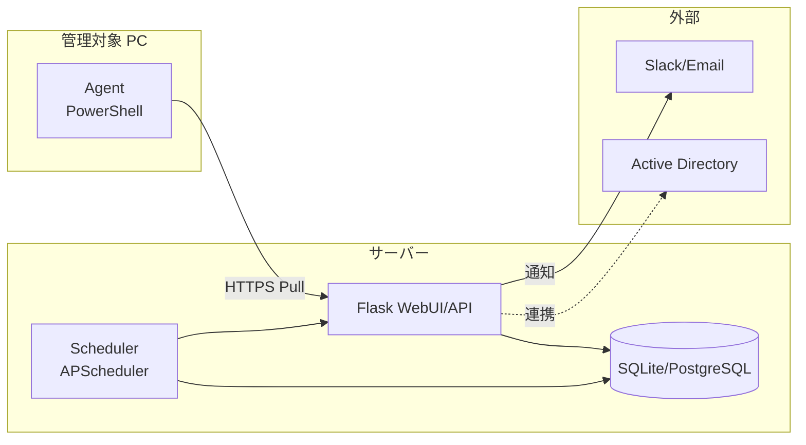

# アーキテクチャ — v1.0

本ドキュメントは v1.0 (2026-10-28 リリース) のシステム構成と責務分離を定義する。
詳細仕様は `docs/アーキテクチャ.md` を参照。

## 1. 全体構成



**Pull 型維持**: サーバー → Agent への能動接続は行わない。Agent が定期的にサーバーへ
ハートビート/結果報告を送る。

## 2. レイヤー責務

| レイヤー | 責務 | 主要ファイル |
|---|---|---|
| Routes | HTTP エンドポイント、認証/認可、入力検証 | `server/routes/*.py` |
| Models | データ永続化、relationship 定義 | `server/models.py` |
| Extensions | Flask 拡張統合 (db/migrate/limiter/cors) | `server/extensions.py` |
| Scheduler | 定期ジョブディスパッチ | `server/scheduler.py` |
| Agent | 収集スクリプト、ジョブ実行 | `agent/` |
| Templates | Jinja2 + CSP nonce | `server/templates/` |
| Static | CSS/JS (CDN なし、すべて self-host) | `server/static/` |

## 3. データフロー

### 収集 (Pull)
```
Agent (cron 5min)
  → POST /api/collect
    → routes/collect.py: 入力検証 + alert rule 評価
      → models.PC.last_seen 更新
      → models.Alert (条件成立時)
```

### ジョブ実行 (Phase B-1)
```
Operator → POST /api/jobs (テンプレ ID + パラメータ)
  → JobTemplate 検証 + 承認要件チェック
    → DB.tasks に queued 投入
      → Agent が次回 poll で取得 → 実行 → 結果 POST
```

## 4. 主要モジュール状態 (2026-05-15)

| モジュール | カバレッジ | 状態 |
|---|---|---|
| app.py | 100% | PR #171 達成 |
| config.py | 100% | PR #169 達成 |
| scheduler.py | 100% | PR #167 達成 |
| collect.py | 100% | PR #161 達成 |
| routes/* | 95% (seed.py 除く) | PR #164 達成 |
| Agent (PS) | Pester | 既存 |

## 5. Phase A での拡張予定

### A-1: DB スキーマ拡張 (Alembic 導入)
- 新規テーブル: `hardware_inventory`, `software_inventory`, `network_interfaces`
- 既存テーブル拡張: `pcs` に `os_build`, `cpu_model`, `ram_gb`, `disk_total_gb`
- マイグレーション運用: `migrations/` ディレクトリ新設、`alembic.ini` 設定

### A-2: Agent 収集拡張
- 新コレクタ: `Get-HardwareInfo.ps1`, `Get-SoftwareInfo.ps1`, `Get-NetworkInfo.ps1`
- `/api/collect` ペイロードスキーマ拡張 (後方互換維持)

### A-3: PC 詳細画面
- 既存 `templates/pc_detail.html` を本実装
- ハードウェア/ソフトウェア/ネットワーク タブ構造
- 履歴グラフ (Chart.js, self-hosted)

### A-4: ダッシュボード KPI
- 稼働率/アラート発生率/ジョブ成功率の可視化
- 期間選択 (24h/7d/30d)

## 5.5. Phase D — Endpoint Stability Insight Module (2026-05-18 統合)

PC-Ops-Orchestrator を「PC 運用自動化」から「**PC 運用・監視・安定性分析の統合基盤**」へ拡張するモジュール群。

### D-1: スコア基盤 (PR #242)
- `StabilityScore` 時系列モデル + 7 日窓スコア (100 → 0、減点ルール: BSOD -30 / Kernel-Power -25 / Disk -20 / Service -5 等)
- `EventLog.category` カラムを追加し `collect.py` で書き込み時に確定 → 集計クエリ O(1) WHERE で済む
- `PC.stability_score` / `last_stability_calc_at` で最新値をキャッシュ

### D-2: 分析 API (PR #242)
| Endpoint | 用途 |
|---|---|
| `/api/stability/scores` | 全 PC スコア一覧 + ステータス (healthy/warning/unstable/critical) |
| `/api/stability/calculate[/<id>]` | バッチ / 単機再計算 |
| `/api/stability/unstable-pcs` | 閾値未満 PC 抽出 |
| `/api/stability/event-ranking` | Event ID 発生回数 TOP N |
| `/api/stability/kb-impact[/<kb_id>]` | KB 適用前後ウィンドウ比較 |
| `/api/stability/similar-issues` | 類似事象 (同 event_id) 検索 |
| `/api/stability/disk-health[?flat=1]` | ディスクイベント (PC 集約 / per-event) |
| `/api/stability/known-issues` CRUD + `/match/<pc_id>` | 社内既知不具合マスタ |

### D-3: ダッシュボード WebUI (PR #242)
- `/stability` メイン + 不安定 PC / KB 影響 / ディスクヘルスの 3 サブページ
- すべて XSS-safe DOM 構築 + クライアントページネーション + CSV エクスポート
- **CSP Phase 3** 準拠 (inline style 排除、addEventListener 統一)

### D-4: 問い合わせ連携 (PR #243 起票予定)
- `Inquiry` モデル + `/api/inquiries` CRUD
- `/api/inquiries/<id>/related-logs` — 対象 PC の最近 14 日の EventLog / Windows Update / Stability Score を相関表示
- `/api/inquiries/similar` — subject LIKE / known_issue_id で類似問い合わせ検索

### 今後のロードマップ (Issues #244-#253)
| Phase | 内容 |
|---|---|
| 2 | 同一機種/部署/拠点軸の類似事象集計, 起動遅延分析 |
| 1 拡張 | ネットワーク疎通監視, アプリ応答遅延監視 |
| 3 | 収集ポリシー管理 UI |
| 4 | MS Windows Release Health 連携, Graph Windows Updates API, AI 原因推定, 自動インシデント起票, 予兆検知 |

## 6. 不変条件 (Phase B/C でも維持)

- Pull 型 Agent
- audit_logs 削除不可
- PowerShell テンプレート制
- CSP 'self' のみ (CDN 禁止)
- 認証なしエンドポイント追加禁止

詳細: `docs/SECURITY_DESIGN.md`
