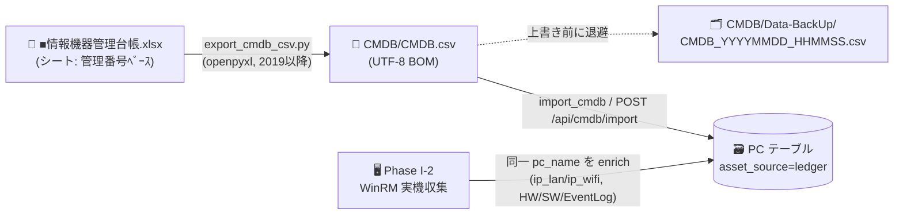
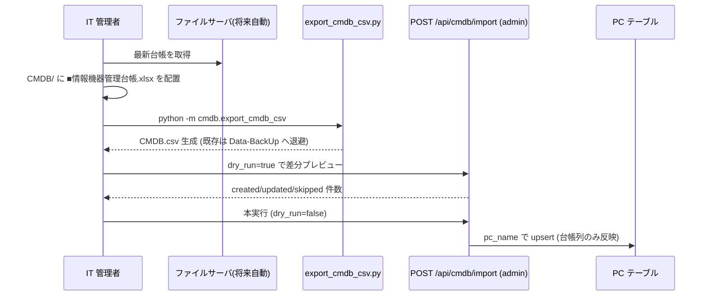

# 🗄️ CMDB 台帳基盤 (Phase I-1)

> Excel 情報機器管理台帳を **単一の真実(正)** とした PC 資産マスタ。台帳 → CSV → DB の取り込みパイプラインを提供する。

## 📌 概要

| 項目       | 内容                                                                            |
| ---------- | ------------------------------------------------------------------------------- |
| 目的       | 登録 PC の資産情報(管理番号/貸与者/社員番号/導入年/MAC)を台帳から DB へ取り込む |
| 正(マスタ) | `CMDB/■情報機器管理台帳.xlsx` シート `管理番号ﾍﾞｰｽ`                             |
| 識別キー   | **管理番号 = AD コンピュータ名 = `PC.pc_name`**                                 |
| 文字コード | CMDB.csv は UTF-8 (BOM 付き) — Excel で文字化けしない                           |
| 収集主体   | 台帳取り込みはサーバ側(Python)。実機詳細収集は Phase I-2(Windows コレクタ)      |



## 🔁 日次運用フロー (手動)



### ① Excel → CSV エクスポート

```bash
cd server
python -m cmdb.export_cmdb_csv \
  --input "../CMDB/■情報機器管理台帳.xlsx" \
  --output ../CMDB/CMDB.csv \
  --sheet "管理番号ﾍﾞｰｽ" \
  --min-year 2019
# 出力例: rows=607 skipped=110 backup=../CMDB/Data-BackUp/CMDB_20260529T094530Z.csv
```

- **2019 年度以降**の行を出力（導入年度が空でも管理番号があれば出力）。
- ヘッダはセル内改行(`MACｱﾄﾞﾚｽ\n【有線】`)を含むため **NFKC 正規化して照合**（列位置に依存しない）。
- 既存 `CMDB.csv` があれば `Data-BackUp/CMDB_<UTCタイムスタンプ>.csv` へ退避してから上書き。
- 台帳に **IP 列は無い**ため、CMDB.csv の「IPアドレス(LAN/WiFi)」列は空。Phase I-2 の WinRM 収集で埋める。

### ② CSV → DB インポート

| 方法             | コマンド/エンドポイント                                                                      |
| ---------------- | -------------------------------------------------------------------------------------------- |
| CLI              | `python -m cmdb.import_cmdb --csv ../CMDB/CMDB.csv [--dry-run]`                              |
| API (multipart)  | `POST /api/cmdb/import` (admin) に `file=CMDB.csv`                                           |
| API (サーバパス) | `POST /api/cmdb/import` (admin) に `{"path":"CMDB/CMDB.csv","dry_run":true,"min_year":2019}` |
| 状態確認         | `GET /api/cmdb/status` (login) → `{ledger_pc_count, last_synced_at, sources}`                |

- `pc_name`(管理番号)で **upsert**。**台帳列のみ反映**し、エージェント由来の `os_version`/`ip_address` 等は上書きしない。
- `asset_source` は既存が `agent`/`winrm` なら維持（実在確認経路を優先）、未収集なら `ledger`。
- MAC は形式検証し大文字コロン区切りへ正規化。不正な MAC はその値のみ null（行自体は採用）。
- `dry_run=true` でコミットせず差分件数のみ返す（本実行前のプレビュー推奨）。

## 🗃️ データモデル (PC 拡張カラム)

| カラム                       | 由来      | 説明                                               |
| ---------------------------- | --------- | -------------------------------------------------- |
| `asset_number`               | 台帳      | 管理番号（= `pc_name`。突合用に明示保持）          |
| `owner_name`                 | 台帳      | 貸与者名（AD CN 相当）                             |
| `employee_id`                | 台帳      | 社員番号（AD SAM 相当）                            |
| `deploy_year`                | 台帳      | 導入年度                                           |
| `mac_wired` / `mac_wireless` | 台帳      | MAC【有線】/【無線】                               |
| `ip_lan` / `ip_wifi`         | Phase I-2 | WinRM 実測で後埋め                                 |
| `ad_cn` / `ad_sam` / `ad_dn` | 将来      | AD→PC 同期用の枠                                   |
| `asset_source`               | 自動      | `ledger`/`agent`/`winrm`（最後に実在確認した経路） |
| `ledger_synced_at`           | 自動      | 最終 import 時刻                                   |

> 有線/無線 MAC は **PC レベル列**で保持。実機 NIC の現況は従来どおり `NetworkInterface` テーブル（2 層管理）。台帳値（カタログ値）と実測値の衝突を避けるため。

## 🔭 Phase I-2 への接続 (本フェーズ外)

サーバ起点 PC 死活＋詳細収集（AD 参加 Windows コレクタ）:

```
ping 管理番号 → IP 取得 → 台帳整合 → ping IP(LAN/WiFi判別)
  → PsExec(.\mirai-user / mirai) で AD 参加確認 + WinRM 強制有効化
  → Invoke-Command で HW/SW/EventLog 収集 → POST /api/collect/remote
```

- 導通不可・PsExec 不可のホストは **理由付きで NG/skip** し、次回同ロジックで再試行。
- 台帳 import が作成した同一 `pc_name` 行を **enrich**（`ip_lan`/`ip_wifi` 実測、`asset_source="winrm"`、HW/SW/EventLog を既存テーブルへ）。
- UI は `asset_source` で「台帳のみ(未収集)」「収集済み」を区別表示。

## 🔐 セキュリティ

- **`CMDB/` は `.gitignore` 済み**（社員名・社員番号を含む Excel/CSV/バックアップを誤コミットしない）。
- `CMDB.csv` / `Data-BackUp/` は **600 相当**の権限（Linux は自動 `chmod 0o600`、Windows 本番は ACL を設定）。
- `POST /api/cmdb/import` の `path` 指定は **`CMDB/` 配下ホワイトリスト + `..`/絶対パス拒否**（パストラバーサル防止）。multipart は Content-Type 検証。
- 個人情報の最小化: `owner_name`/`employee_id` を返す API は `login_required` 以上。監査ログ(`log_operation`)には**件数サマリのみ**残し氏名を大量に記録しない。
- **Phase I-2 の `.\mirai-user`/`mirai`** は弱い共有ローカル資格情報。WinRM 資格情報は **環境変数 `WINRM_USER`/`WINRM_PASSWORD`** で注入し、DB への平文保存は禁止（`docs/SECURITY_DESIGN.md` 参照）。

## ✅ 検証

```bash
cd server
python -m pytest test_cmdb_export.py test_cmdb_import.py test_phase_i1_models.py -v
python -m flask --app app db upgrade   # PC 拡張カラム適用 (down_revision=b3c4d5e6f7a8)
```
