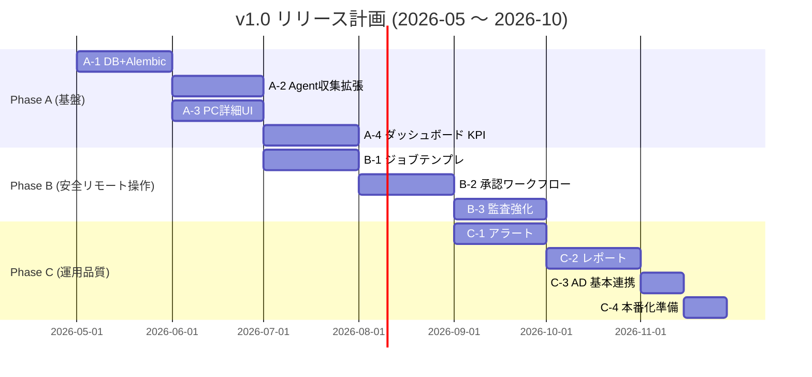

# PC-Ops-Orchestrator — Claude Code 開発指示書 v1.1

**発効日**: 2026-05-15
**対象リリース**: v1.0 本番リリース (期限: 2026-10-28)
**現バージョン**: v1.2.0 (品質強化フェーズ完了)

本書は ClaudeOS v8 プロジェクト設定 (`CLAUDE.md`) を補完し、v1.0 本番リリースまでの
ロードマップ・絶対ルール・スコープ境界を明文化する。

---

## 1. v1.0 ロードマップ (Phase A → B → C)



### Phase A — 基盤 (DB / Agent / UI 骨格)

| サブ | 内容 | 主要成果物 |
|---|---|---|
| A-1 | DB スキーマ拡張 + Alembic 導入 | `migrations/`, モデル追加 (Hardware/Software/JobTemplate 雛形) |
| A-2 | Agent 収集拡張 (HW/SW/Network 詳細) | `agent/collectors/`, `/api/collect` 受信側拡張 |
| A-3 | PC 詳細画面の本実装 | `templates/pc_detail.html`, `routes/pcs.py` |
| A-4 | ダッシュボード KPI 可視化 | `routes/dashboard.py`, Chart.js グラフ |

### Phase B — 安全リモート操作

| サブ | 内容 |
|---|---|
| B-1 | PowerShell ジョブテンプレート機構 (自由実行禁止) |
| B-2 | 承認ワークフロー (リスク 3 段階: low/medium/high) |
| B-3 | 監査ログ強化 (immutable + 差分記録) |

### Phase C — 運用品質

| サブ | 内容 |
|---|---|
| C-1 | アラートエンジン本実装 + 通知チャネル拡張 |
| C-2 | レポート (PDF/CSV) 生成・配信 |
| C-3 | AD 基本連携 (ユーザー同期のみ) |
| C-4 | 本番化準備 (HSTS, バックアップ, ログ集約, ドキュメント) |

---

## 2. 絶対ルール (絶対厳守)

### 2.1 スコープ制御

- **1 セッション = 1 Issue = 1 PR = 1 タスク**
- 複数大機能の同時進行禁止
- ブランチ命名: `feature/<issue番号>-<短い説明>` / `fix/<issue番号>-<短い説明>`
- コミット prefix: `feat: / fix: / docs: / test: / refactor: / chore:`

### 2.2 品質ゲート

- routes/ カバレッジ 90% 以上維持 (現状 95%)
- 主要モジュール (app.py / config.py / scheduler.py / collect.py) 100% 維持
- whole-suite テスト緑必須 (現状 840 tests)
- ruff check + ruff format 両方緑必須
- CodeRabbit Critical/High + Codex Critical/High は同 PR 内で解消

### 2.3 セキュリティ設計 (永続的不変条件)

| 項目 | 制約 |
|---|---|
| 監査ログ | 削除不可。`DELETE /api/audit-logs` 作成禁止。`audit_logs` への DELETE 権限ロール禁止 |
| Agent 通信 | Pull 型維持。サーバーから Agent への能動接続禁止 |
| PowerShell 実行 | テンプレート制のみ。自由実行禁止 |
| XSS 防止 | `innerHTML` への動的値挿入禁止。`textContent` または `escapeHTML()` 使用 |
| 機密情報ログ | パスワード/トークン/APIキーのログ出力禁止 |
| 認証 | 認証なしエンドポイント追加禁止 (公開 API は明示的に PR 説明に記載) |
| CSP | `script-src 'self' 'nonce-...'` / `connect-src 'self'` を維持 (CDN 配信禁止) |
| セキュリティヘッダー | HSTS, X-Content-Type-Options, X-Frame-Options を壊さない |

### 2.4 DB 変更

- **Alembic 必須**。手動 ALTER TABLE 禁止
- マイグレーション逆方向 (downgrade) も実装
- NOT NULL カラム追加時は `server_default` 必須 (SQLite 制約)

### 2.5 コーディング標準

- Python: ruff (check + format) クリーン
- JavaScript: textContent/escapeHTML、innerHTML 動的禁止
- PowerShell: PSScriptAnalyzer クリーン、Pester テスト追加

---

## 3. スコープ外 (v1.0 では実装しない → BACKLOG)

以下は `docs/BACKLOG.md` に保管し、v1.0 リリース後に再評価する:

- Entra ID 統合 (Azure AD 完全連携)
- AI 自動修復 (自律バグ修正)
- キッティング自動化 (Windows 初期構築)
- QR コード資産インベントリ
- 10 ロール権限体系 (現状: admin/operator/viewer の 3 段階で十分)
- PC ライフサイクル全機能 (廃棄ワークフロー等)

---

## 4. セッション開始時テンプレート

```
今回のタスク: [A-1 / A-2 / A-3 / A-4 から1つ選ぶ]
ブランチ: feature/<issue番号>-<short>
完了条件:
  - [ ] Issue 要件すべて満たす
  - [ ] テスト追加 (カバレッジ低下なし)
  - [ ] ruff clean
  - [ ] CodeRabbit + Codex review pass
  - [ ] PR description に変更内容・テスト結果・影響範囲記載
```

---

## 5. 参照

- `CLAUDE.md` — ClaudeOS v8 運用ポリシー
- `docs/BACKLOG.md` — スコープ外項目
- `docs/ARCHITECTURE.md` — システム構成
- `docs/SECURITY_DESIGN.md` — セキュリティ設計
- `docs/アーキテクチャ.md` — 既存アーキテクチャ文書
- `docs/セキュリティ.md` — 既存セキュリティ文書
