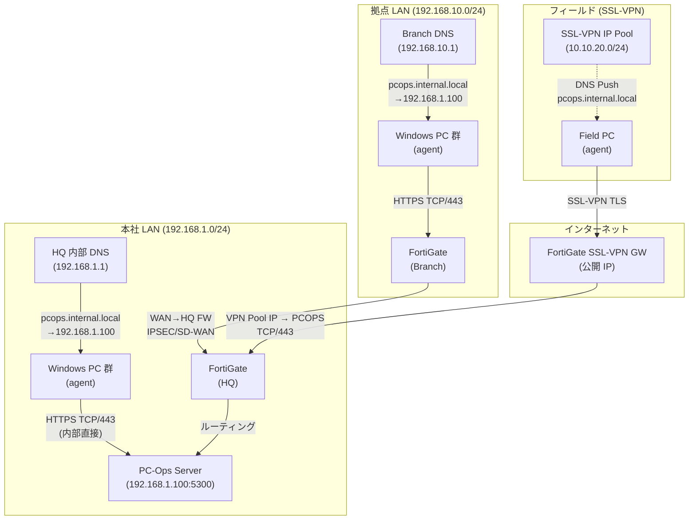

# ネットワーク設計書 — PC-Ops Orchestrator

> **対象読者**: ネットワーク管理者、セキュリティ担当者、インフラエンジニア
> **最終更新**: 2026-05-17

---

## 1. 概要

PC-Ops Orchestrator は Pull 型 HTTPS 通信を採用します。Windows エージェントが
定期的にサーバーへ HTTPS(443) で接続しメトリクスを送信します。

| 項目 | 値 |
|---|---|
| 通信方式 | Pull 型 HTTPS (エージェント→サーバー) |
| サーバー FQDN | `https://pcops.internal.local` |
| 使用ポート | TCP/443 (HTTPS) |
| TLS バージョン | TLS 1.2 以上必須 |
| エージェント認証 | DPAPI 保護 API キー + HMAC-SHA256 署名 |

---

## 2. ネットワーク構成図



---

## 3. ゾーン定義

| ゾーン | サブネット | 説明 |
|---|---|---|
| HQ LAN | 192.168.1.0/24 | 本社社内 LAN。PC-Ops Server 同居 |
| Branch LAN | 192.168.10.0/24 | 拠点 LAN (例: 複数拠点は .10.0/24, .20.0/24…) |
| Field SSL-VPN | 10.10.20.0/24 | フィールド要員の SSL-VPN IP プール |

---

## 4. FortiGate ポリシー設計

### 4.1 本社 FortiGate (HQ)

#### 必須ポリシー

| # | 名称 | Source | Destination | Service | Action | 備考 |
|---|---|---|---|---|---|---|
| 1 | PC-Ops HQ Allow | HQ LAN (192.168.1.0/24) | PC-Ops Server (192.168.1.100) | HTTPS (TCP/443) | ACCEPT | 本社 PC → サーバー |
| 2 | PC-Ops Branch Allow | Branch LAN (192.168.10.0/24) | PC-Ops Server (192.168.1.100) | HTTPS (TCP/443) | ACCEPT | 拠点 PC → サーバー (SD-WAN/IPSEC経由) |
| 3 | PC-Ops VPN Allow | SSL-VPN Pool (10.10.20.0/24) | PC-Ops Server (192.168.1.100) | HTTPS (TCP/443) | ACCEPT | VPN ユーザー → サーバー |
| 4 | Block All Others | ANY | PC-Ops Server (192.168.1.100) | ALL | DENY | 不要アクセス遮断 |

#### セキュリティプロファイル (ポリシー #1〜3 に適用)

| 機能 | 設定 | 理由 |
|---|---|---|
| AntiVirus | Profile: `av-default` | エージェントバイナリのマルウェア検査 |
| IPS | Signature: `default` | 既知エクスプロイト検知 |
| Application Control | `PC-Ops-Agent` カスタムアプリ許可 / SNS/P2P 拒否 | 業務通信のみ許可 |
| Web Filter | Category: `Malware` 拒否 | ドライブバイ感染防止 |
| SSL Inspection | Certificate Inspection | Deep SSL は CA 配布が必要な場合に検討 |

#### ログ設定

```
config log syslogd setting
    set status enable
    set server "192.168.1.200"   # Syslog サーバー IP
    set port 514
    set facility local7
    set format default
end
config log syslogd filter
    set severity information
    set forward-traffic enable
    set local-traffic enable
    set denied-traffic enable
end
```

### 4.2 SSL-VPN 設定 (FortiGate)

```
config vpn ssl settings
    set servercert "server-cert"
    set tunnel-ip-pools "SSLVPN_TUNNEL_ADDR"
    set dns-server1 192.168.1.1            # HQ 内部 DNS
    set dns-suffix "internal.local"        # DNS サフィックス push
    set port 443
    set source-interface "wan1"
end

config vpn ssl web portal
    edit "full-access"
        set tunnel-mode enable
        set split-tunneling disable        # フルトンネル推奨 (全通信を FortiGate 経由)
        set dns-server1 192.168.1.1
        set dns-suffix "internal.local"
    next
end
```

> **Note**: Split-tunneling を有効にする場合は `pcops.internal.local` (192.168.1.100/32) の
> スプリット対象ルートを追加すること。

---

## 5. 内部 DNS 設計

### 5.1 サーバー FQDN

| 用途 | FQDN | IP |
|---|---|---|
| Web UI / API | `pcops.internal.local` | 192.168.1.100 |
| (代替) | `pcops-server.corp.example.com` | 192.168.1.100 |

### 5.2 DNS ゾーン配置

```
internal.local.   SOA   ns1.internal.local.

; PC-Ops Server
pcops             IN A   192.168.1.100
```

### 5.3 各拠点 DNS 設定

| 拠点 | DNS サーバー | 転送設定 |
|---|---|---|
| 本社 | 192.168.1.1 (権威) | `internal.local` ゾーン直接管理 |
| 拠点 | 192.168.10.1 (フォワーダー) | `internal.local` → 192.168.1.1 に転送 |
| SSL-VPN | FortiGate が DNS push | `dns-server1 192.168.1.1` + `dns-suffix internal.local` |

### 5.4 Split-Horizon DNS

社外から公開する必要がない場合 (本プロジェクトのデフォルト):

- **Split-Horizon 不要** — `pcops.internal.local` は内部 DNS のみで解決
- インターネット DNS に `pcops.internal.local` は公開しない
- SSL-VPN クライアントへは FortiGate の DNS Push で自動解決

社外公開が必要になった場合:
- パブリック DNS に `pcops.yourdomain.com` を追加
- TLS 証明書を Let's Encrypt または公的 CA で取得

### 5.5 TLS 証明書選定

| 方式 | 使用場面 | 手順概要 |
|---|---|---|
| **社内 CA (推奨)** | 完全内部運用・外部公開なし | Windows Server CA または cfssl で発行 → エージェント Windows ストアに CA 登録 |
| Let's Encrypt | 外部公開あり / ACME 対応 | Certbot + DNS-01 チャレンジ (HTTP-01 は内部 IP で不可) |
| 自己署名 (非推奨) | 開発/評価のみ | エージェントの `ssl_verify` を `$false` にする必要があり、本番禁止 |

> エージェント側の TLS 検証は `PCOpsAgent.ps1` の `$SSL_VERIFY` 変数で制御されます。
> **本番環境では必ず `$true`** にしてください。

---

## 6. エージェント通信フロー

```
Windows Agent
    │
    │ 1. DPAPI で api_key 復号
    │ 2. メトリクス収集 (CPU/MEM/DISK/NET)
    │ 3. HMAC-SHA256 で pending_tasks 署名
    │ 4. HTTPS POST /api/collect
    ↓
FortiGate (SSL-VPN / ポリシー #1〜3)
    │
    │ AntiVirus / IPS / AppCtrl 検査
    ↓
PC-Ops Server (192.168.1.100:5300)
    │
    │ 5. JWT / API キー認証
    │ 6. HMAC 署名検証
    │ 7. DB 保存 (SQLite → PostgreSQL 移行計画あり)
    ↓
Web UI (管理者ブラウザ)
```

---

## 7. オフライン時の動作 (キャッシュ)

接続できない場合、エージェントは `$env:ProgramData\PCOpsAgent\cache.db` に
SQLite + AES-256-CBC + HMAC-SHA256 でメトリクスを暗号化キャッシュします。

- 鍵保護: Windows DPAPI (CurrentUser scope)
- TTL: 30 日 (期限切れエントリは自動削除)
- 復帰後: `Sync-OfflineCache` で一括送信 → 送信成功したエントリを削除

詳細: [エージェント開発ガイド](エージェント開発ガイド.md) §オフラインキャッシュ

---

## 8. セキュリティチェックリスト

- [ ] FortiGate ポリシー #4 (DENY ALL) が最下位に配置されている
- [ ] SSL-VPN DNS Push で `internal.local` が正しく解決できる
- [ ] PC-Ops Server の TLS 証明書が有効期限内 (`openssl s_client -connect pcops.internal.local:443`)
- [ ] エージェントの `$SSL_VERIFY = $true` になっている
- [ ] Syslog が SIEM/FortiAnalyzer に転送されている
- [ ] AntiVirus プロファイルが FortiGate ポリシーに適用されている
- [ ] API キーローテーション手順が確立されている
